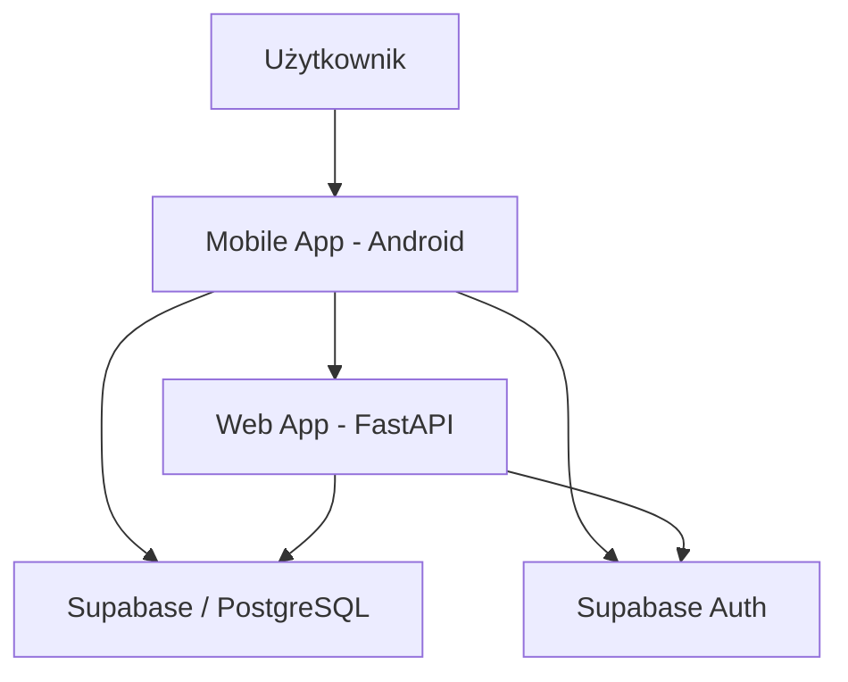

<h1 align="center">FocusQuest </h1>

<i>Transformuj naukę w grę</i>

---

## O Projekcie

**FocusQuest** to system monitorowania czasu skupienia i nauki, składający się z natywnej aplikacji mobilnej oraz panelu webowego. Projekt łączy technikę Pomodoro z mechanikami grywalizacji RPG w celu monitorowania postępów użytkownika.

> **Cel główny:** Osiągnięcie stanu maksymalnej koncentracji poprzez mierzalne śledzenie postępów i gratyfikację wysiłku intelektualnego.

---

## Kluczowe Funkcje

* **Inteligentne Pomodoro** – Konfigurowalne sesje naukowe i przerwy z powiadomieniami.
* **Ewolucja Awatara** – Zdobywaj XP, awansuj na wyższe poziomy.
* **Zaawansowana Analityka** – Wizualizacja czasu nauki i statystyki dzienno-tygodniowe.
* **Globalne Rankingi** – Rywalizuj o miano najbardziej skupionego gracza.
* **Cloud Sync** – Natychmiastowa synchronizacja między aplikacją mobilną a panelem webowym przez Supabase.

---

## Stos Technologiczny

| Warstwa               | Technologia                     | Opis                                        |
| :-------------------- | :------------------------------ | :------------------------------------------ |
| **Mobile**      | **Kotlin / Java**         | Natywna aplikacja na system Android         |
| **Backend**     | **FastAPI (Python)**      | Wydajne API i logika biznesowa              |
| **Baza Danych** | **Supabase / PostgreSQL** | Przechowywanie danych w czasie rzeczywistym |
| **Auth**        | **Supabase Auth**         | Bezpieczne logowanie i autoryzacja          |
| **Analiza**     | **SQLAlchemy / Pydantic** | Modelowanie danych i optymalizacja zapytań |

---

## Architektura Systemu

## Harmonogram Prac (M0 - M6)

| Miesiąc / Faza             | Zadania (Milestones)                   |
| :-------------------------- | :------------------------------------- |
| **M1: Fundamenty**    | Setup Android & Supabase, System Auth. |
| **M2: Serce Systemu** | Implementacja Timera Pomodoro.         |
| **M3: Mechanika RPG** | XP, Poziomy, Awatar, Ekwipunek.        |
| **M4: Ranking**       | Global Leadership & Streaks.           |
| **M5: Dashboard Web** | Frontend analityczny dla użytkownika. |
| **M6: Launch**        | Optymalizacja i premiera Early Access. |

---

  <i>"Skupienie to Twoja największa broń. Rozwijaj ją z FocusQuest."</i>

